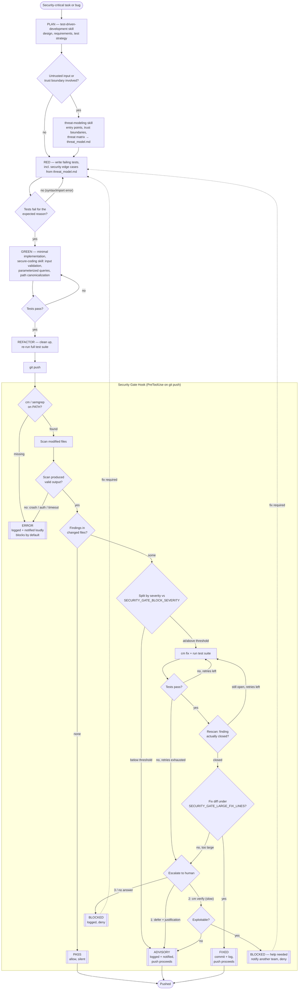

# Secure Coding Configuration with Antigravity & CodeMender

This repository contains the configuration, custom skills, and lifecycle hook script to set up a secure coding environment using Antigravity and the CodeMender CLI (`cm`), and a parallel Claude Code port of the same setup. Codex coming soon.

This setup automatically acts as a first line of defense in your software development lifecycle by scanning modified files for vulnerabilities before they are pushed, guiding automatic remediation, and enforcing test-driven development (TDD).

> [!IMPORTANT]
> **CodeMender Access is Limited:** Access to the CodeMender API and artifacts is currently restricted. Ensure your Google Cloud account has been granted authorization and is associated with a project where the CodeMender API is enabled before attempting to run scans.
> 
> *If you do not have access to CodeMender, you can use the alternate Semgrep-based configuration (see the Lifecycle Hooks section below) to run local, open-source security scans.*

---

## How It Works: The Complete Flow

Two phases, connected by `git push`: an agent-side workflow driven by the three skills (top), and the security gate hook's own decision logic (bottom). A blocked or "help needed" push loops back to the top — the fix goes through RED/GREEN again, not around it.



Rectangles are actions, diamonds are decisions, double-bordered nodes are the five terminal outcomes from the [Outcome model table](#outcome-model-pass--advisory--error--blocked--fixed) below. Note what's *not* in this diagram: `cm verify` only ever appears on the escalation branch (choice 2), never on the path a clean auto-fix takes — see `threat_model.md` T7 for why.

---

## Workspace Structure

### This repository

Each agent's config is self-contained under its own top-level directory, so you only ever copy the one you need; nothing from `antigravity/` is required to use `claude-code/`, or vice versa:

```none
secure-coding-agy-config/
├── antigravity/
│   └── .agents/                       # for Antigravity, copy this whole folder to your workspace root
│       ├── hooks.json
│       ├── hooks_semgrep.json
│       ├── security_gate_hook.sh
│       ├── security_gate_hook_semgrep.sh
│       ├── lib/
│       │   └── gate_common.sh         # shared severity/log/notify/ERROR-handling helpers
│       ├── tests/                     # offline test suite (mocked cm/semgrep) - see Testing Notes
│       │   ├── run_tests.sh
│       │   └── mocks/
│       ├── rules/
│       │   └── security_workflow.md
│       └── skills/
│           ├── test_driven_development/SKILL.md
│           ├── threat_modeling/SKILL.md
│           └── secure_coding/SKILL.md
├── claude-code/
│   ├── CLAUDE.md                      # for Claude Code, copy this file...
│   └── .claude/                       # ...and this whole folder, both to your workspace root
│       ├── settings.json
│       ├── settings.semgrep.json
│       ├── hooks/
│       │   ├── security_gate_hook.sh
│       │   ├── security_gate_hook_semgrep.sh
│       │   ├── lib/
│       │   │   └── gate_common.sh     # shared severity/log/notify/ERROR-handling helpers
│       │   └── tests/                 # offline test suite (mocked cm/semgrep) - see Testing Notes
│       │       ├── run_tests.sh
│       │       └── mocks/
│       └── skills/
│           ├── test-driven-development/SKILL.md
│           ├── threat-modeling/SKILL.md
│           └── secure-coding/SKILL.md
├── threat_model.md                    # threat model for the security gate hook itself
└── README.md
```

### Once copied into your workspace

**Antigravity**: copy the contents of `antigravity/.agents/` from this repo to a `.agents/` folder at the root of your workspace, so Antigravity can discover it:

```none
your-workspace/
├── .agents/
│   ├── hooks.json                     # CodeMender hooks config
│   ├── hooks_semgrep.json             # (Alternate) Semgrep hooks config
│   ├── security_gate_hook.sh          # CodeMender security hook script
│   ├── security_gate_hook_semgrep.sh  # (Alternate) Semgrep security hook script
│   ├── rules/
│   │   └── security_workflow.md
│   └── skills/
│       ├── test_driven_development/
│       │   └── SKILL.md
│       ├── threat_modeling/
│       │   └── SKILL.md
│       └── secure_coding/
│           └── SKILL.md
└── sample_app/ (for testing/practice)
```

**Claude Code**: copy `claude-code/CLAUDE.md` and `claude-code/.claude/` from this repo to the root of your workspace, flattening them so `CLAUDE.md` and `.claude/` sit directly at your workspace root. Claude Code uses the same three primitives as Antigravity, just under different names and paths; `rules/` has no direct equivalent, so the always-on instruction lives in `CLAUDE.md` instead, which Claude Code loads into every session automatically.

Key differences from the Antigravity layout:
- **Skills** are a direct port, just with `name`/`description` frontmatter added and directories renamed to kebab-case (`secure-coding`, `threat-modeling`, `test-driven-development`) per Claude Code convention. Claude invokes them automatically when relevant, or explicitly via `/secure-coding`, `/threat-modeling`, `/test-driven-development`.
- **Rules** (`trigger: always_on`) there's no separate "rules" config in Claude Code, so we put these in top-level CLAUDE.md
- **Hooks** move from a standalone `.agents/hooks.json` to the `"hooks"` key inside `.claude/settings.json`. The matcher targets the `Bash` tool (there's no dedicated `git push` tool), and an `if: "Bash(git push*)"` filter on the hook handler restricts it to push commands specifically. See [Installation & Setup: Claude Code](#installation--setup-claude-code) for the full config and the I/O differences this creates for the hook script.

```none
your-workspace/
├── CLAUDE.md                          # always-on workflow rule (replaces .agents/rules/)
├── .claude/
│   ├── settings.json                  # CodeMender hooks + permissions config
│   ├── settings.semgrep.json          # (Alternate) Semgrep hooks + permissions config
│   ├── hooks/
│   │   ├── security_gate_hook.sh          # CodeMender security hook script
│   │   └── security_gate_hook_semgrep.sh  # (Alternate) Semgrep security hook script
│   └── skills/
│       ├── test-driven-development/
│       │   └── SKILL.md
│       ├── threat-modeling/
│       │   └── SKILL.md
│       └── secure-coding/
│           └── SKILL.md
└── sample_app/ (for testing/practice)
```

---

## Installation & Setup: Antigravity

Copy this repo's `antigravity/.agents/` folder to a `.agents/` folder at the root of your workspace (the layout shown above under *Workspace Structure → Once copied into your workspace → Antigravity*):
```bash
cp -r antigravity/.agents /path/to/your-workspace/.agents
```

### 1. Install Antigravity CLI (`agy`)

The Antigravity CLI is used to manage workspace permissions, inspect agent state, and register lifecycle hooks.

#### Step 1: Download the Binary
Download the `agy` binary corresponding to your platform (e.g., macOS or Linux):
```bash
# For macOS (Apple Silicon / ARM64)
gcloud artifacts generic download \
    --project=antigravity-prod \
    --location=us \
    --repository=antigravity-cli-production \
    --package=agy \
    --version=stable \
    --name=agy-darwin-arm64.zip \
    --destination=./

# For Linux (x86_64)
gcloud artifacts generic download \
    --project=antigravity-prod \
    --location=us \
    --repository=antigravity-cli-production \
    --package=agy \
    --version=stable \
    --name=agy-linux-amd64.zip \
    --destination=./
```

#### Step 2: Install and Verify
Extract the binary and move it to your system path:
```bash
unzip agy-*.zip
chmod +x agy
sudo mv agy /usr/local/bin/agy

# Verify the installation
agy --help
```

---

### 2. Install CodeMender CLI (`cm`)

The CodeMender CLI scans your codebase for common security issues like SQL Injection, Command Injection, and Path Traversal.

#### Step 1: Authentication
Ensure the Google Cloud SDK is authenticated with your credentials:
```bash
gcloud auth application-default login
```

#### Step 2: Download and Install the CLI
```bash
# For macOS (Apple Silicon / ARM64)
gcloud artifacts generic download \
    --project=cmoc-prod \
    --location=us \
    --repository=codemender-cli-production \
    --package=cm \
    --version=stable \
    --name=cm-darwin-arm64.zip \
    --destination=./

# For Linux (x86_64)
gcloud artifacts generic download \
    --project=cmoc-prod \
    --location=us \
    --repository=codemender-cli-production \
    --package=cm \
    --version=stable \
    --name=cm-linux-amd64.zip \
    --destination=./

unzip cm-*.zip
chmod +x cm
sudo mv cm /usr/local/bin/cm

# Verify the installation
cm --help
```

---

## Configuring Workspace & Permissions

### Initialize CodeMender Workspace
To run scans, initialize CodeMender in the root of your workspace:
```bash
cm init
```
This generates a `.codemender` directory containing `config.yaml`. Set `sandbox.enabled: false` if running local tests directly, or customize your extension inclusion filters. Verify the initialization using:
```bash
cm init --verify
```

### Granting Antigravity Permissions
Antigravity executes commands inside a sandboxed environment. Since the `security_gate_hook.sh` script executes the `cm` command, you must explicitly grant Antigravity permission to run the `cm` command prefix.

You can do this by running:
```bash
agy /permissions
```
Or by manually adding `"command(cm)"` to your settings file at:
`~/.gemini/antigravity-cli/settings.json`

---

## Installation & Setup: Claude Code

### 1. Install Claude Code

Follow the [Claude Code installation instructions](https://code.claude.com/docs/en/quickstart) for your platform, then verify:
```bash
claude --version
```

### 2. Install CodeMender CLI (`cm`)

(If you don't have CodeMender access yet, use the Semgrep alternative in step 4 instead: `pip install semgrep` or `brew install semgrep`.)

Same as the Antigravity setup above: authenticate with `gcloud auth application-default login`, download and install the `cm` binary, then initialize the workspace:
```bash
cm init
cm init --verify
```

### 3. Copy the config into your workspace

Copy this repo's `claude-code/CLAUDE.md` and `claude-code/.claude/` folder to the root of your workspace, flattening them so `CLAUDE.md` and `.claude/` sit directly at your workspace root (the layout shown above under *Workspace Structure → Once copied into your workspace → Claude Code*):
```bash
cp -r claude-code/CLAUDE.md claude-code/.claude /path/to/your-workspace/
```

### 4. Activate the CodeMender or Semgrep hook

Only one hook config can be active at a time, since both live at `.claude/settings.json`:
- **CodeMender (default)**: nothing to do — `.claude/settings.json` already wires up `security_gate_hook.sh`.
- **Semgrep (alternate)**: replace it with the Semgrep variant:
  ```bash
  mv .claude/settings.json .claude/settings.codemender.json
  mv .claude/settings.semgrep.json .claude/settings.json
  ```

Make both hook scripts executable:
```bash
chmod +x .claude/hooks/security_gate_hook.sh .claude/hooks/security_gate_hook_semgrep.sh
```

### 5. Grant permission to run `cm` / `semgrep`

Claude Code's Bash tool asks for approval before running commands it hasn't seen before — this is the equivalent of Antigravity's `agy /permissions` step. `.claude/settings.json` already pre-allows the relevant prefix (`Bash(cm:*)` or `Bash(semgrep:*)`) under `"permissions": { "allow": [...] }`, so no manual step is needed unless you've overridden permissions elsewhere (e.g. in `~/.claude/settings.json`).

### How the hook differs from Antigravity's

Claude Code hooks and Antigravity hooks are the same *concept* (a `PreToolUse` handler with a `matcher`, invoking a `command`), but two details had to change when porting `security_gate_hook.sh`:
- **Matching `git push` specifically**: Antigravity's matcher accepted a shell glob (`"git push*"`) directly. Claude Code's `matcher` only filters by tool name (`Bash`, `Edit`, etc.); to filter by the command's *content* you add an `if: "Bash(git push*)"` field on the individual hook handler.
- **Blocking a push**: Antigravity's script printed `{"allow_tool": false, "reason": "..."}`. Claude Code expects `{"hookSpecificOutput": {"hookEventName": "PreToolUse", "permissionDecision": "deny", "permissionDecisionReason": "..."}}` on stdout (or a plain `exit 2`). The ported scripts in `.claude/hooks/` use small `allow()` / `deny()` helpers for this.
- **Interactive prompts**: Claude Code passes the hook's JSON payload on stdin, so the script's own `read -p` prompts (used in the CodeMender RED/GREEN escalation flow) had to be redirected to `/dev/tty` to still work in an interactive terminal session. This doesn't apply to the Semgrep script, which was already non-interactive.

---

## Features & Configurations Injected

> Each item below lists the Antigravity path and, where it differs, the Claude Code path.

### 1. Security-Focused Agent Skills
Antigravity: `antigravity/.agents/skills/` · Claude Code: `claude-code/.claude/skills/` (same `SKILL.md` format, kebab-case directory names):
- **Threat Modeling Skill**: Guides the agent to identify components, map entry points, trust boundaries, and trace data paths before making design or security decisions.
- **Test-Driven Development (TDD) / Prove-It Skill**: Enforces writing a failing reproduction test (RED) before fixing a bug, and verifying that the fix successfully passes the test (GREEN) without breaking regressions.
- **Secure Coding Guidelines**: Guides the agent to validate inputs against allow-lists, prevent SQL injection via parameterized queries, and resolve absolute paths using canonicalization.

### 2. Workflow Enforcement Rules
Antigravity: `antigravity/.agents/rules/security_workflow.md` · Claude Code: `claude-code/CLAUDE.md` (Claude Code has no separate "rules" primitive — always-on instructions live in `CLAUDE.md`, which is loaded into every session automatically):
- **Security-Driven Development Workflow Rule**: An always-on workspace rule that guarantees the agent follows the correct sequence: Planning -> Threat Modeling (producing `threat_model.md`) -> Writing functional & security tests (RED step) -> Implementing secure code (GREEN step, utilizing the Secure Coding Guidelines skill) -> Verification and pushing. [`threat_model.md`](threat_model.md) at the repo root is a real example of this artifact - it documents the security gate hook itself (the one security-critical entry point in this repo), including why some of its design choices (severity-based fail-open, `cm verify` reserved for escalation only) are deliberate trade-offs, not oversights.

### 3. Lifecycle Hooks
There are two hooks configurations available for each agent:

**Antigravity** (`antigravity/.agents/`):
- **CodeMender Hook** (`hooks.json`): Intercepts `git push` to run the CodeMender-based security gate script.
- **Semgrep Hook** (`hooks_semgrep.json`): (Alternate) Use this if you do not have access to CodeMender. Intercepts `git push` to run the Semgrep-based security gate script. Rename this file to `hooks.json` to activate it.

Example `hooks_semgrep.json` configuration:
```json
{
  "semgrep-security-gate": {
    "PreToolUse": [
      {
        "matcher": "git push*",
        "hooks": [
          {
            "type": "command",
            "command": "./.agents/security_gate_hook_semgrep.sh",
            "timeout": 120
          }
        ]
      }
    ]
  }
}
```

**Claude Code** (`claude-code/.claude/`):
- **CodeMender Hook** (`settings.json`, the default): Matches the `Bash` tool with an `if: "Bash(git push*)"` filter, running the CodeMender-based security gate script.
- **Semgrep Hook** (`settings.semgrep.json`): (Alternate) Same idea, running the Semgrep-based script. Rename this file to `settings.json` to activate it (see [Installation & Setup: Claude Code](#installation--setup-claude-code), step 4).

Example `settings.semgrep.json` configuration:
```json
{
  "permissions": {
    "allow": ["Bash(semgrep:*)"]
  },
  "hooks": {
    "PreToolUse": [
      {
        "matcher": "Bash",
        "hooks": [
          {
            "type": "command",
            "if": "Bash(git push*)",
            "command": "$CLAUDE_PROJECT_DIR/.claude/hooks/security_gate_hook_semgrep.sh",
            "timeout": 120
          }
        ]
      }
    ]
  }
}
```

### 4. Hook Scripts
- **CodeMender Gate Script** (`antigravity/.agents/security_gate_hook.sh` / `claude-code/.claude/hooks/security_gate_hook.sh`): Runs CodeMender scan (`cm find`) on modified files. If blocking-severity findings exist, runs an automated RED-GREEN fix loop with `cm fix`, your test suite, and a rescan to confirm the fix actually closed the finding before committing it.
- **Semgrep Gate Script** (`antigravity/.agents/security_gate_hook_semgrep.sh` / `claude-code/.claude/hooks/security_gate_hook_semgrep.sh`): Runs Semgrep scan locally using its open-source config rules (`semgrep scan --config auto --json`). If blocking-severity findings are detected, the script blocks the push and returns the exact list of issues to the agent, which then uses the TDD and Secure Coding skills to write, test, and apply the fixes directly.
- **Shared helpers** (`.../lib/gate_common.sh`): severity ranking, the audit-log/notify helpers, and `handle_scan_error` (see below). Sourced by both gate scripts in each agent's directory; not meant to be run directly.

The two versions of each script are functionally identical; the Claude Code versions differ only in the stdin/stdout contract described above (reading `tool_input.command` from JSON, and emitting `hookSpecificOutput.permissionDecision` instead of `{"allow_tool": ...}`).

#### Outcome model: PASS / ADVISORY / ERROR / BLOCKED / FIXED

A scan finding something is not the only thing this gate needs to distinguish. It also has to tell "the scanner ran and found nothing" apart from "the scanner didn't run at all," and give findings below a severity threshold a way to reach the remote without either blocking the push or vanishing silently:

| Outcome | When | Push proceeds? | Logged / notified? |
|---|---|---|---|
| **PASS** | Scan ran, zero findings. | Yes | No (kept out of the log to avoid noise) |
| **ADVISORY** | Scan ran, findings below `SECURITY_GATE_BLOCK_SEVERITY`. | Yes | Yes - so a false positive or a "let another team pick this up post-push" finding doesn't just disappear into a terminal nobody reads. |
| **ERROR** | The scanner itself couldn't produce a result (missing binary, auth/quota failure, unparseable output). | No, by default | Yes, loudly. **Never** treated the same as "0 findings" (that was a real bug in the previous version: a broken scanner and a clean scan produced an identical silent allow). |
| **BLOCKED** | A blocking-severity finding couldn't be auto-fixed, deferred, or cleared by `cm verify`. | No | Yes |
| **FIXED** | A blocking-severity finding was auto-fixed, the fix was confirmed by a fresh scan (not just "tests passed"), and committed into the push. | Yes | Yes |

`cm verify` (the exploitability check) is expensive because real runs take minutes per finding, so it is **never** called on the common-case path. It's only invoked from the escalation branch (the auto-fix loop couldn't make tests + a rescan pass, or the generated fix diff is too large to auto-trust), and a confirmed-exploitable result there blocks the push with an explicit "help needed" notification rather than a bare deny.

#### Configuring the gate

All of the following are optional environment variables (unset = the default shown), read by `gate_common.sh`:

| Variable | Default | Meaning |
|---|---|---|
| `SECURITY_GATE_BLOCK_SEVERITY` | `HIGH` | Findings at/above this rank block; below it, they're advisory. Accepts CodeMender-style (`CRITICAL`/`HIGH`/`MEDIUM`/`LOW`) or Semgrep-style (`ERROR`/`WARNING`/`INFO`) severities. |
| `SECURITY_GATE_ALLOW_ON_ERROR` | `false` | If `true`, a scanner infrastructure failure (ERROR outcome) lets the push through instead of blocking. Still logged/notified either way. |
| `SECURITY_GATE_LARGE_FIX_LINES` | `50` | A `cm fix` diff larger than this (insertions + deletions) escalates for human review instead of being auto-committed. |
| `SECURITY_GATE_MAX_RETRIES` | `1` | How many times the CodeMender script retries `cm fix` + tests before escalating. |
| `SECURITY_GATE_TEST_CMD` | `python3 -m unittest discover -s tests` | The command run for the GREEN step. Override for non-Python test suites. |
| `SECURITY_GATE_NOTIFY_CMD` | *(unset)* | If set, invoked with a JSON event on stdin for ADVISORY/ERROR/BLOCKED outcomes - e.g. a small wrapper script that posts to Slack or files a ticket, so another team is actually looped in instead of relying on someone reading terminal output. |
| `SECURITY_GATE_LOG` | `<repo root>/.security-gate/findings-log.ndjson` | Append-only local audit trail (one JSON object per line: timestamp, outcome, actor, commit, findings). Best-effort telemetry, not a tamper-evident record - see `threat_model.md` T5. |
| `SECURITY_GATE_STATE_DB` | `~/.codemender/state.db` | Where the CodeMender script writes suppression/dismiss records. |

#### Testing the gate scripts offline

Each agent's hook directory ships a small, dependency-free test suite that mocks `cm`/`semgrep` (see `tests/mocks/`) and drives the real scripts against a throwaway git repo, so the PASS/ADVISORY/ERROR/BLOCKED/FIXED branching can be verified without real CodeMender or Semgrep access:

```bash
# Antigravity
bash antigravity/.agents/tests/run_tests.sh

# Claude Code
bash claude-code/.claude/hooks/tests/run_tests.sh
```

Both require `jq` and `git` on `PATH` (the same runtime dependencies the hooks themselves have) and currently pass 26/26. What they don't cover: the interactive escalation menu's actual choice-handling beyond "no/blank input fails closed" (feeding a real terminal session goes beyond what a scripted test can drive), and both scripts still assume CodeMender's real `cm report` output uses a `Severity` field - this is called out as a `VERIFY:`-style assumption in the code and threat model, since it's only checkable against a live `cm` account.

---

## Walkthrough: CodeMender CLI Basics

> [!NOTE]
> **Agent Automation:** While this walkthrough covers how to run the CodeMender CLI commands manually to understand their behavior, these commands (`cm find`, `cm fix`, `cm verify`) are automatically run and managed by the Antigravity agent in the background via the pre-push hook configuration.

### Sample Application Setup
Create a file named `sample_app/data_service.py` to practice scanning:
```python
import os
import sqlite3
import hashlib
from flask import Flask, request, jsonify

app = Flask(__name__)

app.config['SECRET_KEY'] = 'SuperSecretKey123!@#'

@app.route('/user')
def get_user():
    username = request.args.get('username')
    conn = sqlite3.connect('users.db')
    cursor = conn.cursor()
    query = f"SELECT * FROM users WHERE username = '{username}'"
    cursor.execute(query)
    user = cursor.fetchone()
    conn.close()
    return jsonify(user)

@app.route('/read_file')
def read_file():
    filename = request.args.get('file')
    with open(os.path.join('/var/www/uploads', filename), 'r') as f:
        content = f.read()
    return content

@app.route('/ping')
def ping_host():
    ip = request.args.get('ip')
    cmd = f"ping -c 1 {ip}"
    os.system(cmd)
    return "Ping initiated"

def hash_password(password):
    return hashlib.md5(password.encode()).hexdigest()

if __name__ == '__main__':
    app.run(debug=True)
```

### Scanning for Vulnerabilities
Scan the file:
```bash
cm find sample_app/data_service.py
```
This discovers multiple critical vulnerabilities (SQL Injection, Path Traversal, Command Injection, Insecure Hashing).

### Querying Findings
View active scan findings locally:
```bash
cm report
```

### Verifying Findings (Exploitability Checks)
Verify if the path traversal can be actively exploited:
```bash
cm verify <finding_id>
```

This may take some time because CodeMender provisions a sandbox to test an exploit.

### Remediating Findings
Fix a specific SQL Injection finding automatically:
```bash
cm fix <finding_id>
```
CodeMender generates the remediation patch, outputs a code diff, and updates your workspace files.

---

## Testing Ideas

The [offline mocked suite](#testing-the-gate-scripts-offline) (`tests/run_tests.sh` in each agent's hook directory) covers the hook's decision logic: PASS/ADVISORY/ERROR/BLOCKED/FIXED branching, severity routing, the large-diff escalation path - without needing real CodeMender/Semgrep access. It deliberately doesn't cover everything. Some directions worth pursuing next, roughly in order of where the current gaps are:

**Close the "verified against a mock, not the real tool" gap**
- **Schema/contract test for `cm report`**: run a real `cm report --format json` against a seeded finding and assert the fields the hook depends on (`FindingID`, `FilePath`, `Severity`) actually exist. This turns the `Severity`-field assumption flagged in `threat_model.md` and the code comments from "unverified guess" into a check that fails loudly the moment CodeMender's schema doesn't match, instead of silently miscategorizing a finding's severity.
- **End-to-end run against `sample_app/data_service.py`**: commit the intentionally vulnerable file from the walkthrough above, push it through the real agent (not the offline mocks), and assert the push is blocked with the expected finding count/types for both the CodeMender and Semgrep variants. This is the only way to catch drift between what the mocks assume and what the real tools actually emit.

**Regression-test the failure modes that were bugs once**
- **Chaos test for the ERROR path**: rename/remove the `cm`/`semgrep` binary, or point `SECURITY_GATE_STATE_DB`/auth at something broken, and assert the hook denies (or allows only with `SECURITY_GATE_ALLOW_ON_ERROR=true` set explicitly) rather than silently passing. This is a direct regression test for the fail-open bug described in `threat_model.md` T1 - the kind of test that would have caught it before it shipped.
- **Fuzz `severity_rank()` and the file-matching filter**: random/adversarial inputs (unknown severity strings, unicode/space-containing filenames, mixed path separators, empty findings arrays) against `gate_common.sh`'s `severity_rank()` and the `endswith`-based path filter - both have already had one real bug each.
- **Audit-log integrity check**: after a run that produces several ADVISORY/ERROR events, assert `.security-gate/findings-log.ndjson` is still valid line-delimited JSON (`jq -s . < log`). A partially-written or malformed line would silently break downstream log aggregation.

**Close the "not exercised" gap in the interactive path**
- **Drive the escalation menu via a pty**: use `expect`, `script`, or Python's `pty` module to actually answer the RED confirmation and the 1/2/3 escalation prompts end-to-end, instead of only testing the "blank input fails closed" case the offline suite currently covers.

**Test the parts that aren't hook logic at all**
- **Skill-adherence eval harness**: the PLAN → threat-model → RED → GREEN sequence in the diagram above is enforced by instruction, not by code - nothing currently checks that the agent actually followed it. A lightweight harness could run the agent against a fixed set of seeded vulnerable-code tasks (e.g. each `sample_app` endpoint) headlessly, then grade the transcript + git history automatically: was `threat_model.md` written before the fix commit, does an earlier commit contain a test that fails against the vulnerable code, does the final diff avoid the patterns the secure-coding skill prohibits (`os.system`, string-formatted SQL, `pickle.loads`, etc.)? This is the main way to get feedback on the *skills* half of the diagram, since it's not unit-testable the way the hook script is.
- **Golden-transcript regression**: snapshot a known-good transcript for a canonical task (e.g. "fix the SQLi in `/user`") and diff future runs against it to catch silent drift in skill invocation order as the skill docs or model change.

**Close the "local hook is bypassable" gap**
- **CI-side mirror**: add a required GitHub Actions/GitLab CI check that runs the same scan (or `gate_common.sh` logic) on every PR, and a test that pushes a branch with a known vulnerability to confirm the CI check actually fails. This is less "test the hook" and more "test that the hook isn't the only thing standing between a vulnerability and `main`" - see `threat_model.md` B1/T4.
- **Cross-platform matrix**: run `tests/run_tests.sh` in CI across Windows Git Bash, WSL, macOS, and Linux - these are bash scripts with no platform abstraction, and Windows in particular wasn't part of the original design assumptions.

## Credits & References

- **Test-Driven Development (TDD) Skill**: Inspired by and adapted from classic TDD methodologies:
  - *Test-Driven Development: By Example* by Kent Beck.
  - *Three Laws of TDD* by Robert C. Martin (Uncle Bob).
